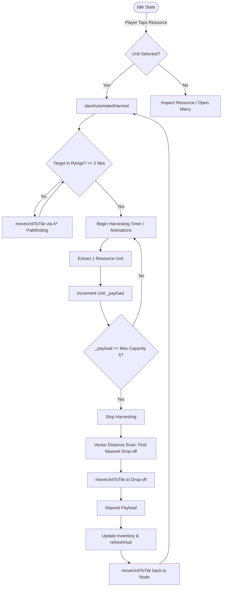
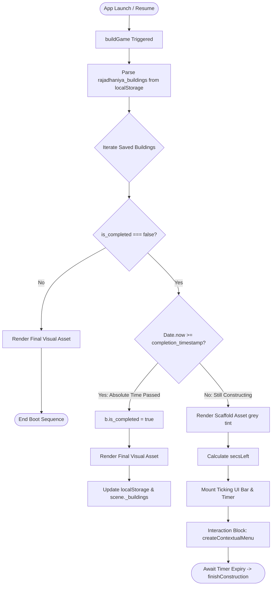
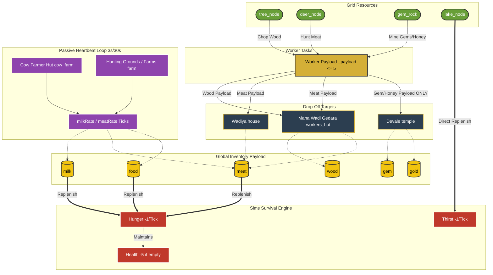

# Rajadhaniya Engine Architecture

This document serves as the centralized, definitive technical mapping for the Rajadhaniya codebase. 

> [!IMPORTANT]
> **Strict Engineering Protocol:**
> 1. **Read & Absorb First:** Before executing any code modifications, feature additions, or era implementations, developers must thoroughly comprehend these flowcharts.
> 2. **Logic Alignment:** Every single line of code written must perfectly align with the structural constraints, asset restrictions, drop-off rules, and data routing pipelines defined below.
> 3. **Keep Docs Updated:** If a future implementation fundamentally alters a system flow, the corresponding flowchart in this document must be updated before the code is committed.

---

## 1. Automated Harvesting Loop Flowchart (AoE Economy)

This workflow outlines the continuous Age of Empires style resource extraction loop managed inside `game_bridge.js`.

---

## 2. Background Construction Timer Workflow

This diagram maps out the boot-sequence logic when handling the absolute Unix timestamps for our Clash of Clans style background construction.

---

## 3. Flutter-to-Phaser Data Sync Pipeline

This outlines the cross-layer communication architecture between the Phaser engine (WebGL) and the native Flutter wrapper connecting to Firebase.

```mermaid
flowchart LR
    subgraph Phaser Engine WebGL
        A1[Player Action Build/Harvest] --> A2[Core Game State Mutated]
        A2 --> A3[refreshHud Triggered]
        A3 --> A4[Generate Lightweight JSON Payload]
        A4 -->|Includes: gold, tasks, needs, buildings, forceSync| A5[window.notifyFlutter]
    end

    subgraph JS/Dart Bridge
        B1{Environment Check}
        A5 --> B1
        B1 -- Android/iOS --> B2[window.FlutterBridge.postMessage]
        B1 -- Flutter Web --> B3[window._flutterCallback]
    end

    subgraph Native Flutter App
        C1[_onJsEvent Listener]
        B2 --> C1
        B3 --> C1
        C1 --> C2[setState: Update _hudData Dashboard]
        C2 --> C3{forceSync === true?}
    end

    subgraph Firebase Cloud
        C3 -- Yes: Immediate Backup --> D1[FirestoreService.saveUserData]
        C3 -- No: Background Throttling --> D2[_cloudSyncTimer 60s]
        D2 --> D1
        D1 --> D3[(Cloud Firestore Document)]
    end
```

---

## 4. Era of Veddas Engine Mapping (Data & Logic Restraints)

This visualizes how the grid nodes route through the worker pipeline, the strict building drop-off restrictions, the passive heartbeat loops, and the survival mechanics.

