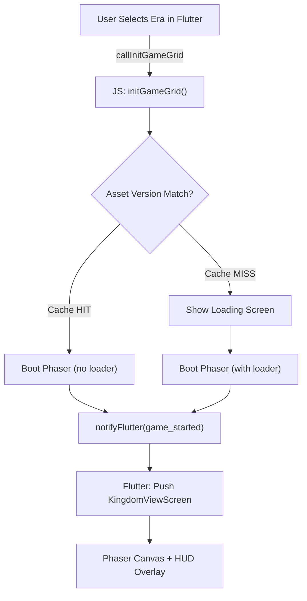

# Rajadhaniya — Complete Technical Documentation

**Version:** 1.3.11  
**Platform:** Flutter Web + Phaser 3  
**Language:** Dart + JavaScript  
**License:** GNU General Public License v3.0  
**Project Status:** Active Development  

---

## Table of Contents

1. [Project Overview](#project-overview)
2. [Repository Structure](#repository-structure)
3. [Technology Stack](#technology-stack)
4. [Core Architecture](#core-architecture)
5. [Project Configuration](#project-configuration)
6. [Dart/Flutter Implementation](#dartflutter-implementation)
7. [JavaScript Game Bridge](#javascript-game-bridge)
8. [Data Models](#data-models)
9. [Core Game Logic](#core-game-logic)
10. [Development Workflow](#development-workflow)
11. [Asset Management](#asset-management)
12. [Build & Deployment](#build--deployment)

---

## Project Overview

**Rajadhaniya** is an isometric historical real-time strategy and kingdom-building mobile game deeply rooted in ancient Sri Lankan history. The game follows a unique hybrid architecture combining:

- **Flutter Web UI** for menus, dialogs, and HUD overlays
- **Phaser 3** for the 2.5D isometric game world rendering
- **Bidirectional JavaScript Bridge** for seamless communication between layers

### Key Features

- 🏛️ **Historical Era Progression:** Six distinct historical periods from Prehistoric to Modern era (1948-2026)
- ⚔️ **Sena Kanda (War Barracks):** Train 10 unique troop classes with Clash-of-Clans-style mechanics
- 🏗️ **Kingdom Building:** Isometric grid-based construction system with A* pathfinding
- 👺 **Epic Raids & Bosses:** Defend or raid against historical and mythical threats
- 📜 **Bi-lingual Support:** Native English and Sinhala (සිංහල) gameplay
- 🗂️ **JSON-Driven Core:** Fully modular architecture with configuration-driven gameplay

---

## Repository Structure

```
rajadhaniya-game/
├── lib/
│   ├── main.dart                          # App entry point & landscape wrapper
│   ├── bridge/
│   │   ├── js_bridge.dart                 # Conditional export (web/stub)
│   │   ├── js_bridge_web.dart             # Web-only JS bridge implementation
│   │   ├── js_bridge_stub.dart            # Test/WASM stub implementation
│   │   ├── platform_view_registry.dart    # Conditional export for platform views
│   │   ├── platform_view_registry_web.dart # Web HtmlElementView registration
│   │   └── platform_view_registry_stub.dart # Test/WASM stub
│   ├── models/
│   │   ├── historical_era.dart            # HistoricalEra model + 6 era constants
│   │   └── troop.dart                     # Troop model + 10 troop constants
│   └── screens/
│       ├── language_selection_screen.dart # First-launch language picker
│       ├── era_selection_screen.dart      # 3×2 era card grid
│       ├── kingdom_view_screen.dart       # Main game HUD + Phaser overlay
│       ├── sena_kanda_screen.dart         # Troop training dashboard (modal)
│       ├── update_screen.dart             # Asset version mismatch dialog
│       └── no_internet_screen.dart        # Network status overlay
│
├── web/
│   ├── index.html                         # HTML host with Phaser CDN + Flutter script
│   ├── game_bridge.js                     # Complete Phaser 3 game logic (~72KB)
│   ├── manifest.json                      # PWA manifest
│   ├── favicon.png                        # App icon
│   ├── assets/
│   │   ├── game/
│   │   │   └── images/
│   │   │       └── loadingscreen.png      # Loading screen background
│   │   └── [other web assets]
│   └── icons/
│       └── [PWA icons]
│
├── assets/
│   └── images/
│       ├── avatar_prehistoric.png         # Era-specific avatars
│       ├── avatar_anuradhapura.png
│       └── avatar_temp.png
│
├── test/
│   └── widget_test.dart                   # Flutter widget tests
│
├── pubspec.yaml                           # Dart/Flutter dependencies
├── pubspec.lock                           # Locked dependency versions
├── analysis_options.yaml                  # Dart linter configuration
├── Eras.json                              # Historical era reference data
├── game_logic_spec.md                     # Game design specifications
├── AGENTS.md                              # Development notes & changelog
├── remove_bg.py                           # Python utility for image processing
├── analyze.py                             # Code analysis helper
├── README.md                              # User-facing project overview
└── .gitignore                             # Git ignore patterns

```

---

## Technology Stack

### Core Technologies

| Layer | Technology | Version | Purpose |
|-------|-----------|---------|---------|
| **UI Framework** | Flutter | Latest | Cross-platform UI rendering |
| **Web Platform** | Flutter Web | Latest | HTML/CSS/JS compilation |
| **Game Engine** | Phaser 3 | 3.60.0 | 2D/2.5D isometric rendering |
| **Language (Frontend)** | Dart | 3.11.5+ | Flutter application code |
| **Language (Game)** | JavaScript | ES6+ | Phaser game logic & bridge |
| **State Persistence** | `localStorage` | Browser API | Session-based game state |
| **Preferences** | `shared_preferences` | 2.5.5 | Local user settings |
| **Maps** | `flutter_map` | 7.0.2 | OSM map integration |
| **Coordinates** | `latlong2` | 0.9.1 | Latitude/longitude utilities |
| **Web Interop** | `dart:js` | Built-in | Dart-to-JS communication |

### Development Dependencies

```yaml
dev_dependencies:
  flutter_test:
    sdk: flutter
  flutter_lints: ^6.0.0
```

### Build & Platform Support

- **Android:** API 26+ (via Flutter APK/AAB)
- **iOS:** Future support via Flutter IOS target
- **Web:** HTML5, CSS3, JavaScript ES6+
- **Desktop:** Flutter Desktop targets possible
- **WASM:** Supported via conditional imports (js_bridge_stub.dart)

---

## Core Architecture

### Hybrid Rendering Model

```
┌─────────────────────────────────────────────────────┐
│        Flutter Web Container (HTML Renderer)        │
│  ┌───────────────────────────────────────────────┐  │
│  │  Era Selection / Language / Update Dialogs    │  │
│  └───────────────────────────────────────────────┘  │
│  ┌───────────────────────────────────────────────┐  │
│  │       Kingdom View Screen (HUD Overlay)       │  │
│  │  ┌─────────────────────────────────────────┐  │  │
│  │  │  Player Profile | Resources | Tasks     │  │  │
│  │  │  Menu | Settings | Train | Build Btns   │  │  │
│  │  └──────────────────────────────���──────────┘  │  │
│  └───────────────────────────────────────────────┘  │
│  ┌───────────────────────────────────────────────┐  │
│  │   Phaser 3 Canvas (z-index: 1)               │  │
│  │   - Isometric grid rendering                 │  │
│  │   - Sprite animation & particles             │  │
│  │   - Tap gestures & movement                  │  │
│  │   - Building placement system                │  │
│  └───────────────────────────────────────────────┘  │
└─────────────────────────────────────────────────────┘
```

### Unidirectional Data Flow (UDF)

```
Flutter User Action (Tap Era)
    ↓
EraSelectionScreen._onEraTap()
    ↓
JsBridge.callInitGameGrid(eraId, name, bonus, lat, lng, language)
    ↓
JavaScript: initGameGrid() → Load assets → bootPhaserGame()
    ↓
JS: window.notifyFlutter({ type: 'hud_update', ... })
    ↓
Dart: _onJsEvent() → setState() → Update HUD
    ↓
Flutter re-renders dashboard with new data
```

### Conditional Compilation Strategy

The project uses **conditional exports** to support multiple platforms:

**lib/bridge/js_bridge.dart** (Conditional Export)
```dart
export 'js_bridge_stub.dart'
    if (dart.library.js) 'js_bridge_web.dart';
```

| Platform | Export | Features |
|----------|--------|----------|
| **Web** | `js_bridge_web.dart` | Full JS interop via `dart:js` |
| **Mobile** | `js_bridge_stub.dart` | No-op stubs (WebView approach) |
| **Desktop** | `js_bridge_stub.dart` | No-op stubs |
| **WASM** | `js_bridge_stub.dart` | No-op stubs |

---

## Project Configuration

### pubspec.yaml

```yaml
name: rajadhaniya
description: "A new Flutter project."
publish_to: 'none'
version: 1.0.0+1

environment:
  sdk: ^3.11.5

dependencies:
  flutter:
    sdk: flutter
  cupertino_icons: ^1.0.8           # iOS-style icons
  flutter_map: ^7.0.2               # OpenStreetMap integration
  latlong2: ^0.9.1                  # Geo-coordinate utilities
  web: ^1.1.1                       # Web package for interop
  shared_preferences: ^2.5.5        # Local preferences storage

dev_dependencies:
  flutter_test:
    sdk: flutter
  flutter_lints: ^6.0.0             # Code analysis

flutter:
  uses-material-design: true
  assets:
    - assets/images/                # Flutter-loaded image assets
```

### analysis_options.yaml

```yaml
include: package:flutter_lints/flutter.yaml

linter:
  rules:
    # Default Flutter lint rules
    # Custom rules can be enabled/disabled here
```

### web/index.html

**Key Components:**

1. **Phaser 3 CDN**: Loads Phaser from `cdn.jsdelivr.net`
2. **Game Bridge**: Loads local `game_bridge.js`
3. **Flutter Configuration**: Forces HTML renderer to avoid WebGL conflicts
4. **Noto Sans Sinhala Font**: Google Fonts for Sinhala text rendering

```html
<!DOCTYPE html>
<html>
<head>
  <meta charset="UTF-8">
  <title>Rajadhaniya</title>
  <link rel="manifest" href="manifest.json">
  <link href="https://fonts.googleapis.com/css2?family=Noto+Sans+Sinhala:wght@400;600;700&display=swap" rel="stylesheet">
  <style>
    html, body { width: 100%; height: 100%; overflow: hidden; }
    #flutter-container { display: flex; width: 100%; height: 100%; }
  </style>
</head>
<body>
  <div id="flutter-container">
    <script src="https://cdn.jsdelivr.net/npm/phaser@3.60.0/dist/phaser.min.js"></script>
    <script src="game_bridge.js"></script>
  </div>
  <script>
    // Force HTML renderer (no WebGL to avoid conflicts with Phaser)
    window.addEventListener('load', function() {
      _flutter.loader.load({
        onEntrypointLoaded: async function(engineInitializer) {
          const appRunner = await engineInitializer.initializeEngine({
            renderer: 'html',
          });
          await appRunner.runApp();
        }
      });
    });
  </script>
  <script src="flutter_bootstrap.js" async></script>
</body>
</html>
```

---

## Dart/Flutter Implementation

### lib/main.dart — Entry Point

**Key Responsibilities:**

```dart
void main() async {
  WidgetsFlutterBinding.ensureInitialized();
  registerPhaserView();  // Register Phaser canvas as platform view
  final prefs = await SharedPreferences.getInstance();
  final initialLang = prefs.getString('selected_language');
  runApp(RajadhaniyaApp(initialLanguage: initialLang));
}
```

**RajadhaniyaApp State:**
- Manages global JS event routing via `_onJsEvent(Map<String, dynamic>)`
- Handles network status, version mismatches, and game start events
- Provides `GlobalKey<NavigatorState>` for dynamic navigation

**_LandscapeWrapper:**
- Enforces landscape-only orientation via `LayoutBuilder`
- Displays rotation prompt if device is in portrait
- Ensures responsive 16:9 aspect ratio

### lib/bridge/ — JavaScript Bridge

#### js_bridge.dart (Conditional Export)
Conditional export resolves to either web or stub based on platform.

#### js_bridge_web.dart (Web Implementation)

**Core Methods:**

```dart
class JsBridge {
  // Game Initialization
  static void callInitGameGrid(String eraId, String eraName, String eraBonus, 
                               double lat, double lng, String lang)
  
  // Game Control
  static void showFlutterUi()
  static void forceAssetUpdate()
  static void checkAssetVersion()
  
  // Building Placement
  static void enterBuildMode(String buildingType)
  
  // State Query
  static bool get isGameActive
  
  // Event Registration
  static void registerFlutterCallback(void Function(Map<String, dynamic>) callback)
}
```

**Implementation Details:**

- Uses `dart:js` for direct JavaScript interop
- Converts JS `JsObject` to Dart `Map<String, dynamic>` for type safety
- Handles both JSON strings and native JS objects
- Registers global callback `_flutterCallback` for reverse notifications

```dart
js.context['_flutterCallback'] = (dynamic data) {
  if (data is String) {
    // JSON string path
    final decoded = jsonDecode(data);
    callback(Map<String, dynamic>.from(decoded));
  } else if (data is js.JsObject) {
    // JS object path: convert via Object.keys()
    final keys = js.context['Object'].callMethod('keys', [data]) as js.JsArray;
    final map = <String, dynamic>{};
    for (final k in keys) {
      map[k as String] = data[k];
    }
    callback(map);
  }
};
```

#### platform_view_registry_web.dart (Platform View Registration)

Registers the Phaser canvas as a Flutter `HtmlElementView`:

```dart
void registerPhaserView() {
  final platformViewRegistry = webOnlyPlatformViewRegistry;
  platformViewRegistry.registerViewFactory('phaser-game', (int viewId) {
    final container = html.DivElement()
      ..id = 'game-container'
      ..style.width = '100%'
      ..style.height = '100%'
      ..style.zIndex = '1000';
    return container;
  });
}
```

Allows Flutter to embed Phaser canvas via:
```dart
const HtmlElementView(viewType: 'phaser-game')
```

### lib/models/ — Data Models

#### HistoricalEra

```dart
class HistoricalEra {
  final String id;           // 'prehistoric', 'anuradhapura', etc.
  final String name;         // Sinhala name
  final String englishName;  // English name
  final String period;       // Historical period (e.g., "c. 30,000 BCE – 500 BCE")
  final String bonus;        // Era bonus (e.g., "Hunting & Stone Tools +30%")
  final String icon;         // Unicode emoji
  final double lat;          // OSM latitude
  final double lng;          // OSM longitude
}
```

**Predefined Eras:**

| ID | English Name | Period | Bonus | Icon |
|----|--------------|--------|-------|------|
| prehistoric | Prehistoric & Protohistoric | c. 30,000 BCE – 500 BCE | Hunting & Stone Tools +30% | 🏹 |
| anuradhapura | Anuradhapura Period | c. 377 BCE – 1017 CE | Farming & Irrigation +25% | 🌾 |
| polonnaruwa | Polonnaruwa Period | 1017 CE – 1232 CE | Gold & International Trade +20% | 🏯 |
| transitional | Transitional Period | 1232 CE – 1594 CE | Fortress Defense & Training +25% | ⛰️ |
| colonial | Colonial Era | 1505 CE – 1948 CE | Cash Crops & Modern Roads +20% | 🚢 |
| modern | Independence to 2026 | 1948 CE – 2026 | Full OSM Infrastructure Map | 🏙️ |

#### Troop

```dart
class Troop {
  final String id;               // 'troop_padati_soldier', 'hero_maharaja', etc.
  final String name;             // Sinhala + English name
  final String role;             // 'Frontline Swordsman', 'Heavy Tank', etc.
  final int housingSpaceCost;    // Space required in housing
  final String ability;          // Special ability name
  final String whereCanBuildIt;  // Unlock requirement
  final String unlockBuildCost;  // Cost to unlock (e.g., "100 Food")
  final String unlockBuildTime;  // Build time for barracks
  final String trainingTime;     // Training duration
  final String whatItDoes;       // Behavior description
  final String description;      // Long-form unit description
  
  int get trainingTimeSeconds   // Parsed seconds from trainingTime string
}
```

**10 Troop Types:**

1. **Padati Soldier** (පාබල සෙබළා) — Frontline infantry swordsman
2. **Dunuvaya** (දුනුවායා) — Ranged archer marksman
3. **Maha Yodha** (මහා යෝධයා) — Heavy defensive shield tank
4. **Kollakaraya** (කොල්ලකරු) — Resource plunderer (2x loot)
5. **Prakara Bhedaka** (ප්‍රාකාර බිඳින්නා) — Wall demolisher (kamikaze)
6. **Mantrakaraya** (මන්ත්‍රකාරයා) — Splash damage sorcerer
7. **Loha Juggernaut** (ලෝහ යෝධයා) — Heavy armored iron knight
8. **Maharaja** (මහාරාජා) — Immortal king tank leader (hero)
9. **Bisawa/Rani** (රැජින) — High-DPS ranged stealth queen (hero)

### lib/screens/ — UI Screens

#### LanguageSelectionScreen

**Purpose:** First-launch language picker  
**Persistence:** `SharedPreferences` key: `selected_language`  
**Values:** `'en'` (English) or `'si'` (Sinhala)

#### EraSelectionScreen

**Layout:** 3×2 grid of era cards  
**Interaction:** Tap era → `_onEraTap()` → `JsBridge.callInitGameGrid()` → Phaser boot

**Static Callbacks:**
- `onGameStarted` — Triggered when Phaser loads successfully
- `onVersionMismatch` — Triggered on asset version mismatch
- `onShowUpdateDialog` — Shows update confirmation dialog

#### KingdomViewScreen

**Main Game HUD Screen**

**Layout Structure:**
```
┌─ SafeArea ─────────────────────────────────┐
│ ┌─ Top HUD Row ──────────────────────────┐ │
│ │ Player Profile | Resources | Tasks     │ │
│ └────────────────────────────────────────┘ │
│                                             │
│   [Phaser Canvas Fills Remaining Space]    │
│                                             │
│ ┌─ Bottom Control Row ────────────────────┐ │
│ │ Menu | Settings | Train | Build Buttons │ │
│ └────────────────────────────────────────┘ │
└─────────────────────────────────────────────┘
```

**Components:**

1. **Player Profile Card**
   - Avatar (era-specific image)
   - Era name (Sinhala)
   - Level badge (0-10 based on progress %)
   - Progress bar (glowing green)
   - "NEXT ERA" button when max progress reached

2. **Resource Bar**
   - Gold balance (🪙)
   - Wood count (🪵)
   - Gems count (💎)
   - Food/Hunting (🏹)

3. **Task Bar**
   - Building progress (House, Farm, Mine, Workers, Temple, Lake, Boat, Fence)
   - Fish harvesting count
   - All tracked via `_hudData['tasks']` from JS

4. **Control Buttons**
   - Menu (📋)
   - Settings (⚙️)
   - Train (🛡️ — Opens SenaKandaScreen)
   - Build (🏛️ — Opens build menu bottom sheet)

**Translation System:**
```dart
String _translate(String key) {
  if (_language == 'si') {
    // Sinhala translations map
  }
  return key; // English fallback
}
```

#### SenaKandaScreen

**Purpose:** Troop training dashboard (modal bottom sheet)  
**Layout:**
- Status bar: Housing space / Total queue time
- GridView: Troop cards with +/- selectors
- Active training queue display
- Resource cost validation

#### UpdateScreen

**Purpose:** Asset version mismatch notification  
**Trigger:** `version_mismatch` JS event  
**Action:** `forceAssetUpdate()` + reload Phaser

#### NoInternetScreen

**Purpose:** Network status overlay  
**Trigger:** `network_status` JS event  
**Position:** `Positioned.fill()` to cover entire screen

---

## JavaScript Game Bridge

### web/game_bridge.js — Phaser 3 Game Engine

**File Size:** ~72 KB  
**Phaser Version:** 3.60.0  
**Game Architecture:** Single scene (`main`)  

### High-Level Flow

```javascript
1. initGameGrid(eraId, eraName, eraBonus, lat, lng, language)
   ├─ Check asset version (localStorage)
   │  ├─ Cache HIT: Boot Phaser immediately
   │  └─ Cache MISS: Show loading screen + notify Flutter
   ├─ Boot Phaser scene with eraId config
   └─ Emit notifyFlutter({ type: 'game_started' })

2. Scene: main
   ├─ preload()
   │  ├─ Load loading screen image
   │  ├─ Generate procedural textures (grass, player, tree, etc.)
   │  └─ Set up progress tracking
   ├─ create()
   │  ├─ [if showLoader] loaderSequence() → fade-out
   │  └─ buildGame()
   │     ├─ Initialize isometric grid (10×10 tiles)
   │     ├─ Place resources (trees, deer, gems)
   │     ├─ Load persisted buildings from localStorage
   │     ├─ Spawn player sprite
   │     ├─ Spawn NPC citizens
   │     ├─ Set up input handlers (tap, double-tap)
   │     └─ Start NPC AI scheduling
   └─ update()
       └─ (Empty; all movement is tween-based)

3. Game Events
   ├─ Single Tap: Move player (A* pathfinding)
   ├─ Double Tap: Toggle radial task menu
   ├─ Drag: Pan camera
   ├─ Pinch: Zoom camera
   └─ Click Resource: Open contextual harvest menu
```

### Isometric Coordinate System

```javascript
// Tile dimensions
const TILE_W = 64;  // Tile width in pixels
const TILE_H = 32;  // Tile height in pixels
const GRID = 10;    // 10×10 grid (100 tiles total)

// Cartesian → Isometric conversion
function cartToIso(cx, cy) {
  return {
    x: (cx - cy) * (TILE_W / 2),
    y: (cx + cy) * (TILE_H / 2)
  };
}

// Isometric → Cartesian conversion (inverse)
function isoToCart(ix, iy) {
  return {
    x: (ix / (TILE_W / 2) + iy / (TILE_H / 2)) / 2,
    y: (iy / (TILE_H / 2) - ix / (TILE_W / 2)) / 2
  };
}
```

### Key Game Objects

#### Player Sprite
- Position: Grid-based (cartesian coordinates)
- Animation: Walk cycle on movement
- Depth Sorting: `setDepth(tx + ty + 1)` for isometric sorting
- Movement: Tweened path following (120ms per tile)

#### Resources (Trees, Deer, Gem Rocks)
- Spawn: Random grid placement (avoiding player)
- Animation: Idle floating tween (Sine.easeInOut)
- Interaction: Single tap → contextual harvest menu
- Harvesting: 10-second timer with progress bar
- Reward: +1 resource, float text animation, particle effect

#### Buildings
- Types: House, Farm, Mine, Workers, Temple, Lake, Boat, Fence
- Placement: "Ghost building" mode (transparent preview)
- Confirmation: ✅/❌ popup menu
- Construction: 5-second timer (visible grey overlay)
- Persistence: `localStorage.rajadhaniya_buildings` (JSON array)

#### NPCs (Citizens)
- Count: 5 per era
- Spawn: Random grid placement
- AI: Self-scheduling recursive movement (A* pathfinding)
- Animation: Walk cycle synced to tweens

### A* Pathfinding Algorithm

```javascript
function getPath(startTile, endTile, occupied) {
  // A* implementation with heuristic (Manhattan distance)
  // Returns: array of cartesian tile coordinates
  // Avoids: occupied buildings, players, boundaries
  // Used for: Player movement, NPC autonomous routing
}
```

**Key Features:**
- Handles obstacles (buildings, resources)
- Respects grid boundaries
- Optimized for 10×10 grid (performance suitable for web)
- Used by both player and NPCs

### Local Storage Schema

```javascript
// Asset version (prevents cache-inconsistency crashes)
localStorage.setItem('rajadhaniya_asset_version', 'v1.3.11');

// Unlocked eras (e.g., after completing prehistoric)
localStorage.setItem('era_anuradhapura_unlocked', 'true');

// Persisted buildings
localStorage.setItem('rajadhaniya_buildings', JSON.stringify([
  { type: 'house', tx: 3, ty: 4, status: 'complete' },
  { type: 'farm', tx: 5, ty: 5, status: 'constructing', timeLeft: 3000 },
  // ...
]));

// Player data (current session)
window.localPlayerData = {
  gold: 500,
  wood: 100,
  gem: 50,
  hunting: 0,
  tasks: {
    house: 1,
    farm: 0,
    mine: 0,
    // ... other tasks
  },
  config: {
    house: { req: 5 },
    farm: { req: 3 },
    // ... building requirements
  }
};
```

### Phaser Configuration

```javascript
const config = {
  type: Phaser.AUTO,  // Auto-detect (WebGL → Canvas)
  renderer: 'html',   // Force HTML (no WebGL conflicts)
  parent: 'game-container',
  scale: {
    mode: Phaser.Scale.NONE,
    autoCenter: Phaser.Scale.CENTER_BOTH,
  },
  scene: {
    preload: preload,
    create: create,
    update: update,
  },
};
```

### Event Notifications to Flutter

```javascript
// Notify Flutter of game events
function notifyFlutter(payload) {
  if (window._flutterCallback) {
    window._flutterCallback(payload);
  }
}

// Example events
notifyFlutter({
  type: 'game_started',
  eraId: 'prehistoric',
});

notifyFlutter({
  type: 'hud_update',
  gold: 600,
  tasks: {
    house: 2,
    farm: 1,
    // ...
  },
  config: {
    house: { req: 5 },
    // ...
  },
});

notifyFlutter({
  type: 'version_mismatch',
  storedVersion: 'v1.2.0',
  expectedVersion: 'v1.3.11',
});
```

---

## Data Models

### Historical Era Constants (Eras.json)

Located in `lib/models/historical_era.dart`:

```dart
final List<HistoricalEra> historicalEras = [
  const HistoricalEra(
    id: 'prehistoric',
    name: 'ප්‍රාග් ඓතිහාසික යුගය',
    englishName: 'Prehistoric & Protohistoric',
    period: 'c. 30,000 BCE – 500 BCE',
    bonus: 'Hunting & Stone Tools +30%',
    icon: '🏹',
    lat: 6.6521,
    lng: 80.6922,
  ),
  // ... 5 more eras
];
```

### Troop Constants (Troop.dart)

Located in `lib/models/troop.dart`:

```dart
const List<Troop> allTroops = [
  Troop(
    id: "troop_padati_soldier",
    name: "Padati Soldier (පාබල සෙබළා)",
    role: "Frontline Swordsman Vanguard",
    housingSpaceCost: 1,
    ability: "Angam Swarm Aggression",
    whereCanBuildIt: "Sena Kanda (War Barracks) Level 1",
    unlockBuildCost: "100 Food",
    unlockBuildTime: "10 Seconds",
    trainingTime: "5 Seconds",
    whatItDoes: "Sprints to the nearest structural fortification or enemy unit, attacking with quick Kastane sword strikes.",
    description: "A fierce infantry foot soldier armed with a traditional blade. Highly effective when deployed in massive swarms to overwhelm outlying village structures.",
  ),
  // ... 9 more troops
];
```

---

## Core Game Logic

### Game Initialization Sequence



### Resource Management

**HUD Update Loop:**
1. JS game state changes (resource gathered, building placed)
2. `localPlayerData` updated in `window`
3. `notifyFlutter({ type: 'hud_update', gold, tasks, config })`
4. Flutter `_onJsEvent()` updates `_hudData`
5. `setState()` triggers rebuild
6. HUD displays updated resources/progress

### Building Placement (Clash-of-Clans Style)

```javascript
1. User taps "Build" in Flutter
2. JsBridge.enterBuildMode('house')
3. JS: showGhostBuilding('house')
   ├─ Transparent preview sprite follows mouse
   ├─ Green if valid placement, red if occupied
4. User taps grid
   ├─ Lock ghost building position
   ├─ Show confirmation popup (✅/❌)
5. User confirms (✅)
   ├─ Ghost → Solid + greyed out
   ├─ Start 5-second construction timer
   ├─ Persist to localStorage
   ├─ Update Flutter HUD
```

### NPC AI Routing

```javascript
// Self-scheduling NPC movement
function scheduleNPCMove(npc) {
  setTimeout(() => {
    // Pick random valid destination
    const dest = getRandomFreeTile();
    
    // Calculate A* path
    const path = getPath(npc.currentTile, dest, occupiedTiles);
    
    // Tween along path (120ms per tile)
    tweenAlongPath(npc, path);
    
    // Schedule next move after arrival
    scheduleNPCMove(npc);
  }, randomDelay);
}
```

### Task Completion & Era Progression

**Task Requirements (Per Era):**
```javascript
const TASK_CONFIG = {
  house: { req: 5, icon: '🏠' },
  farm: { req: 3, icon: '🌾' },
  mine: { req: 2, icon: '⛏️' },
  // ... etc
};
```

**Progress Calculation:**
```javascript
function updateProgress() {
  let totalProgress = 0;
  for (const [taskKey, config] of Object.entries(TASK_CONFIG)) {
    const current = window.localPlayerData.tasks[taskKey] || 0;
    const required = config.req;
    totalProgress += Math.min(current / required, 1.0);
  }
  const overallPercent = (totalProgress / Object.keys(TASK_CONFIG).length) * 100;
  
  if (overallPercent >= 100) {
    showEraCompletionDialog();
    localStorage.setItem(`era_${nextEraId}_unlocked`, 'true');
  }
  
  notifyFlutter({ type: 'hud_update', progress: overallPercent });
}
```

### Combat/Raid System (Future)

Planned architecture:
- Troop deployment queue (trained in Sena Kanda)
- A* pathfinding toward enemy structures
- Collision detection for walls/towers
- Health system for units and buildings
- Resource reward/loss on win/defeat

---

## Development Workflow

### Local Setup

```bash
# Clone repository
git clone https://github.com/KasunPremarathna/rajadhaniya-game.git
cd rajadhaniya-game

# Install Dart/Flutter dependencies
flutter pub get

# (Optional) Update to latest Flutter SDK
flutter upgrade

# Run Flutter web
flutter run -d chrome

# (Or use web device)
flutter run -d web-server
```

### Running the Game

**Flutter Web (Development):**
```bash
flutter run -d chrome
# Accessible at http://localhost:xxxxx
```

**Flutter Web (Production Build):**
```bash
flutter build web --release
# Outputs to build/web/
```

### Code Structure Principles

1. **Conditional Imports:** Platform-specific code isolated in bridge files
2. **Stub Implementations:** Non-web platforms get no-op stubs
3. **Clean Separation:** Dart UI / JavaScript Game / Bridge layer
4. **Reactive State:** Flutter manages UI state; Phaser manages game world

### Adding New Eras

1. Add `HistoricalEra` constant to `lib/models/historical_era.dart`
2. Create era-specific avatar image: `assets/images/avatar_[eraId].png`
3. Update `_getAvatarAsset()` in `KingdomViewScreen` to return new avatar
4. Add era-specific task config to JS `TASK_CONFIG`
5. Update `GAME_ASSET_VERSION` in `game_bridge.js`

### Adding New Troops

1. Add `Troop` constant to `lib/models/troop.dart`
2. Update `allTroops` list with new unit
3. Update troop training UI in `SenaKandaScreen`
4. Implement combat behavior in JS (A* targeting, damage calc)
5. Update `GAME_ASSET_VERSION`

### Adding New Buildings

1. Add building to JS `BUILDINGS_CONFIG`:
```javascript
const BUILDINGS_CONFIG = {
  myBuilding: {
    cost: { gold: 50, wood: 10, gem: 0 },
    constructTime: 5000,
    size: 1,
  },
  // ...
};
```

2. Create procedural texture or load AI-generated image
3. Add to Flutter build menu in `KingdomViewScreen._buildMenuCard()`
4. Implement interaction (harvest, upgrade, etc.)
5. Update `GAME_ASSET_VERSION`

---

## Asset Management

### Image Assets

**Flutter Assets** (`assets/images/`)
- Era-specific avatars (PNG, 192×192px minimum)
- Fallback avatar for testing

**Web/Phaser Assets** (`web/assets/game/`)
- `loadingscreen.png` — Loading screen background
- AI-generated building/resource sprites

### Asset Loading Strategy

**Flutter:**
- Static `AssetImage()` loading via pubspec.yaml
- Cached by Flutter framework

**Phaser:**
- `scene.load.image()` for HTTP-loaded assets
- `generateTexture()` for procedural graphics (grass, particles)
- `localStorage` caching for asset version verification

### Procedural Graphics (Phaser)

```javascript
// Grass tile (green square with shadow)
const graphics = scene.make.graphics({ x: 0, y: 0, add: false });
graphics.fillStyle(0x76c644, 1);
graphics.fillRect(0, 0, 64, 32);
scene.textures.generateTexture('grass_tile', graphics, 64, 32);
graphics.destroy();
```

**Generated Textures:**
- `grass_tile` — Ground tile background
- `player` — Era-tinted player sprite
- `tree` — Wood resource
- `deer` — Hunting resource
- `gem_rock` — Gem resource
- `leaf` — Particle (harvest effect)
- `spark` — Particle (construction effect)

---

## Build & Deployment

### Flutter Web Build Process

```bash
flutter build web --release --web-renderer=html
```

**Output:** `build/web/`
- `index.html` — Entry point
- `flutter.js` — Flutter Web engine
- `main.dart.js` — Compiled Dart application
- `game_bridge.js` — Phaser game logic
- `assets/` — Image assets
- `favicon.ico`, `manifest.json` — PWA metadata

### Platform Deployment

**Web Hosting (Firebase, GitHub Pages, etc.):**
1. Build release: `flutter build web --release`
2. Deploy `build/web/` folder to host
3. Ensure MIME types correct for `.js` files

**Android (Future):**
```bash
flutter build apk --release
# or
flutter build appbundle --release
```

**iOS (Future):**
```bash
flutter build ios --release
```

### Performance Optimization

1. **Phaser Canvas:** Force HTML renderer (no WebGL conflicts)
2. **Asset Caching:** `localStorage` prevents re-download
3. **Code Splitting:** Lazy load era-specific assets
4. **Procedural Textures:** Reduce HTTP requests
5. **Tween-based Animation:** CPU-efficient movement

### Version Management

**Asset Version Tracking:**
```javascript
const GAME_ASSET_VERSION = "v1.3.11";

// On Phaser boot, save version
localStorage.setItem('rajadhaniya_asset_version', GAME_ASSET_VERSION);

// Check version on next load
const stored = localStorage.getItem('rajadhaniya_asset_version');
if (stored !== GAME_ASSET_VERSION) {
  notifyFlutter({ type: 'version_mismatch', ... });
}
```

---

## API Reference

### JavaScript Bridge Methods

| Method | Signature | Purpose |
|--------|-----------|---------|
| `initGameGrid` | `(eraId, eraName, eraBonus, lat, lng, language)` | Boot game with era config |
| `forceAssetUpdate` | `()` | Clear version cache + reload |
| `showFlutterUi` | `()` | Destroy Phaser, show Flutter UI |
| `checkAssetVersion` | `()` | Verify localStorage version |
| `enterBuildMode` | `(buildingType)` | Start building placement mode |
| `notifyFlutter` | `(payload)` | Send event to Flutter callback |

### Flutter Bridge Methods

| Method | Signature | Purpose |
|--------|-----------|---------|
| `callInitGameGrid` | `(eraId, name, bonus, lat, lng, lang)` | Call JS game init |
| `forceAssetUpdate` | `()` | Force JS asset refresh |
| `enterBuildMode` | `(buildingType)` | Start building placement |
| `isGameActive` | (getter) | Check if Phaser running |
| `registerFlutterCallback` | `(callback)` | Register JS event handler |

### Event Types (JS → Flutter)

```dart
// Game started successfully
{ type: 'game_started' }

// HUD update (resources, task progress)
{ type: 'hud_update', gold: 600, tasks: {...}, config: {...} }

// Asset version mismatch
{ type: 'version_mismatch', storedVersion: 'v1.2.0', expectedVersion: 'v1.3.11' }

// Network status
{ type: 'network_status', isOnline: true }
```

---

## Troubleshooting

### Common Issues

**WebGL Context Lost Error:**
- **Cause:** CanvasKit and Phaser competing for WebGL context
- **Solution:** Force HTML renderer in `index.html`:
```javascript
renderer: 'html',  // Not 'canvaskit'
```

**"Phaser is not defined" Error:**
- **Cause:** Phaser CDN not loaded before `game_bridge.js`
- **Solution:** Ensure `<script src="https://cdn.jsdelivr.net/npm/phaser@3.60.0/dist/phaser.min.js"></script>` loads before `game_bridge.js`

**Flutter HUD Not Updating:**
- **Cause:** `_onJsEvent` not registered or JS bridge callback not firing
- **Solution:** Check JS bridge registration in `KingdomViewScreen.initState()`:
```dart
JsBridge.registerFlutterCallback(_onJsEvent);
```

**Buildings Persisting Across Eras:**
- **Cause:** localStorage not cleared between eras
- **Solution:** Clear `rajadhaniya_buildings` when switching eras or start fresh per era

---

## License

GNU General Public License v3.0 (GPLv3)  
See `LICENSE` file for full text.

---

## Contributing

Contributions welcome! Please:
1. Fork the repository
2. Create a feature branch: `git checkout -b feature/my-feature`
3. Commit changes: `git commit -am 'Add new feature'`
4. Push to branch: `git push origin feature/my-feature`
5. Open a Pull Request with detailed description

---

## Authors & Credits

**Lead Developer:** KasunPremarathna  
**Game Design:** Historical Sri Lankan Kingdom-Building Strategy  
**Architecture:** Hybrid Flutter Web + Phaser 3  
**Special Thanks:** OpenStreetMap contributors, Phaser community

---

## Change Log

### v1.3.11 (Current)
- WebGL crash fix (HTML renderer enforcement)
- Sprite scaling standardization (0.25 scale)
- Single-tap harvest interaction (removed double-tap)
- Contextual popup menu redesign (220×180px)
- Progress render fix (minimum 8px width)
- Sena Kanda training dashboard
- AI asset replacements for buildings/resources
- Fences building support
- HUD responsiveness improvements
- Construction timer system (5-second build)
- Load speed optimization (100ms grace period)

### v1.0.0 (Initial Release)
- Isometric grid rendering (64×32 tiles)
- Era selection screen
- Single-tap movement with A* pathfinding
- Resource gathering mechanics
- Task completion tracking
- Era progression system
- localStorage persistence
- Bi-lingual UI (English + Sinhala)

---

**Last Updated:** June 20, 2026  
**Repository:** https://github.com/KasunPremarathna/rajadhaniya-game
